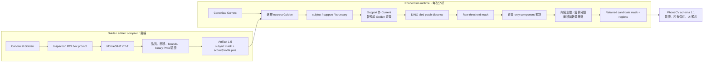

# Golden 主體分割與背景抑制設計

> 現行 schema-1.6 runtime 已由 [Paired Current/Golden 主體內部比較](paired_current_subject_runtime.md) 取代本文件的 Golden-only scoring 流程。本文件保留 schema-1.5／wire-1.1 的設計與歷史 E2E 證據；「MobileSAM 不在 runtime 執行」只適用於該舊版路徑。

更新日期：2026-08-03

## 決策摘要

SAM 適合協助回答「Golden 中哪些像素屬於被檢設備」，但不應回答「Current 中哪些像素是缺陷」。本專案採用下列責任邊界：

- MobileSAM ViT-T 只在離線 Golden artifact compiler 執行一次，以 immutable Inspection ROI 的 bounding box 作為 prompt。
- 編譯結果是與 Golden canonical image、模型來源、權重和 Recipe 綁定的 binary subject mask；服務啟動與每次分析都不載入或執行 MobileSAM。
- Runtime 由 Golden subject mask 派生 `subject`、`support` 與 `boundary` 三個 canonical masks，並在 DINO 推論前把 support 外的 Current 背景替換成同位置的 Golden 像素。
- DINO 只產生相對差異強度；經 threshold、主體空間限制、最小面積和 `maxRegions` 後才形成最終「差異候選」。SAM 與 DINO 都不是 defect proof，`phone_dino` 也不輸出 PASS／FAIL。
- PhoneCV analyzer request schema 1.1 消費並驗證這些 evidence；Phone Dino artifact schema 1.5 保存生成它們所需的 immutable pins，並加入 scorer-input 與 recipe-profile 身分。

這個設計會抑制遠離設備的桌面、牆面、線材與光影差異，同時保留落在設備內或貼近設備邊緣的外來物、缺件與輪廓變化，供 PhoneCV 顯示與後續政策判讀。

## 資料流與責任邊界



PhoneDino 提供的是可追溯 observation。PhoneCV 擁有 comparison assessment、人工覆核與任何製造決策政策。LightGlue 仍只允許 feature flag／shadow benchmark，沒有因為導入 SAM 而成為正式對位方法。

## 為什麼不在 Current 上重新執行 SAM

Current 影像可能剛好包含要找的缺件、附著物、破損或遮擋。如果每次都讓 SAM 重新定義 Current 主體，模型可能把「不再像 Golden 的部分」排除在 Current mask 外，反而抹掉真正需要保留的差異。每次推論產生的 mask drift 也會把 segmentation 變化混入 anomaly evidence。

因此 runtime 只使用 Golden 階段已凍結的空間先驗：

1. `subject` 是 MobileSAM 對 canonical Golden 的 binary segmentation。
2. `support` 是 subject 向外膨脹 `supportPaddingPx` 後再裁切於 immutable Inspection ROI 的區域。它保留壓在設備上或貼近輪廓的外來物。
3. `boundary` 是 subject 內外各 `boundaryBandPx` 的輪廓帶。候選若碰到這個帶，標記為 `SUBJECT_BOUNDARY`，而不是當作背景自動丟棄。

歷史 v11 工程 artifact 使用 `supportPaddingPx=24`、`boundaryBandPx=10`。Runtime 以 `subject - boundary` 作為內縮主體；完全沒有碰到 subject core 的 component 會記入 `suppressedByBackgroundCount`，不會回傳為候選。觸及 boundary band 的 component 保守標為 `SUBJECT_BOUNDARY`，且主體內部候選會先於邊界候選占用 `maxRegions`。這兩個 mask 參數是 Recipe artifact 的一部分；調整它們必須重新編譯並產生新 digest，不能在 runtime 臨時覆寫。

## Pre-DINO 背景替換

只在 DINO 輸出後把 ROI 外 heatmap 清零仍不夠安全，因為 transformer attention 在推論時已看過不同背景，背景特徵可能影響主體 patch 分數。Subject-gated 路徑會在每個 tile 送入 DINO 前執行：

```text
effective_current[pixel] =
  current[pixel]  ，pixel 在 Golden support mask 內
  golden[pixel]   ，pixel 在 Golden support mask 外
```

Golden tile 不變。如此 Current 與 Golden 在 support 外完全一致，背景不能再透過該 tile 的 DINO attention 造成差異；其後 heatmap 與 threshold mask 也會再次在 support 外歸零。這項限制只作用於 spatial evidence，現有 full-frame `globalDistance` 仍是 advisory 指標，不應當成 defect score。

## Artifact schema 1.5

Artifact 1.5 保留 1.3 的 `subjectSegmentation`，並在 1.4 evidence identity 上新增 immutable scorer-input contract 與 recipe analysis profile。`subjectSegmentation` 包含：

- `method=MOBILE_SAM_VIT_T_BOX_PROMPT`
- `usageMode=SPATIAL_GATE`
- `approvalState=ENGINEERING_AUTO|APPROVED`
- `promptPolicy=INSPECTION_ROI_BOUNDING_BOX_V1`
- MobileSAM repository tree digest 與 weights SHA-256
- canonical dimensions、模型品質與 foreground ratio 範圍
- `supportPaddingPx`、`boundaryBandPx`
- 每個 Golden 一份 `goldenId`、canonical SHA、binary PNG、mask SHA、prompt、quality score 與 foreground ratio

Compiler 會拒絕 repository／weights digest 不符、SAM dependency 或權重不可用、mask 尺寸不符、非 binary／空 mask、品質或面積超出政策、mask 超出 Inspection ROI，以及 Golden embedding 與 subject mask 未一對一綁定。Compiler 以 create-only 方式輸出，不覆寫既有 artifact。

Schema 1.5 另外 digest-bind `scorerInputContract`（ROI-only composite、neutral RGB 與尺寸策略）、四種 Golden reference roles，以及整體 `recipeAnalysisProfile`。Runtime 不需要 MobileSAM repository 或 weights。它只需要已驗證的 artifact 1.5、DINO repository／weights 與 service pins。這縮小了線上依賴、啟動時間與供應鏈範圍，也讓同一 artifact 的主體範圍與 scorer input 可重現。

## Observation schema 1.1

PhoneCV 對工程 profile 送出 schema 1.1 request。可用時，`analysis.subjectSegmentationEvidence` 必須完整包含：

- `state=AVAILABLE`
- `disclaimerCode=SUBJECT_MASK_NOT_DEFECT_PROOF`
- method、usage mode、Golden ID 與 MobileSAM pins
- prompt、foreground／support／background-suppressed ratios
- canonical `subject`、`support`、`boundary` PNG 及各自 SHA-256

相對應的 spatial evidence 使用：

```json
{
  "generationMethod": "SUBJECT_GATED_ROI_TILED_PATCH_DISTANCE",
  "disclaimerCode": "DIFFERENCE_NOT_DEFECT_PROOF",
  "rawThresholdMaskPngBase64": "<binary PNG>",
  "candidateFilter": {
    "rawComponentCount": 12,
    "retainedComponentCount": 3,
    "suppressedSmallRegionCount": 8,
    "suppressedByLimitCount": 1,
    "maskSemantics": "RETAINED_CANDIDATES"
  },
  "maskPngBase64": "<retained-candidates-only binary PNG>"
}
```

數字僅示意。`rawThresholdMask` 保存 threshold 後、component filter 前的候選；最終 `maskPng` 只允許包含已通過 `minRegionAreaRatio` 且位於 `maxRegions` 內的 retained components。每個 region 的 `kind` 是 `SUBJECT_INTERIOR` 或 `SUBJECT_BOUNDARY`。因此 regions、candidate counts 與最終 mask 使用相同語意，不再發生「mask 還顯示已被 regions 篩掉的小區塊」的不一致。

## PhoneCV 銜接與顯示

PhoneCV 必須以 exact-key contract 驗證 schema 1.1、base64 PNG、SHA-256 與 canonical dimensions，再將圖片移出 JSON，分別存進每次分析獨立的 Server-private comparison folder：

```text
candidate-mask.png
raw-threshold-mask.png
subject-mask.png
support-mask.png
boundary-mask.png
difference-heatmap.png
```

Browser 只取得 authenticated evidence URLs，不取得 blob key、filesystem path 或內嵌 base64。結果頁使用「最終候選、DINO heatmap、主體範圍、邊界不確定」等名稱，避免把 `candidate-mask` 稱作 defect mask。UI 應同時顯示 raw／retained／suppressed counts 與背景抑制比例，讓使用者知道小差異為何被保留或過濾。

PhoneCV 的 engineering profile 另外 pin `requiredSubjectSegmentationMethod` 與 `requiredSubjectMaskSha256`。Readiness metadata 或 response 與 profile 不一致時，不得偷偷退回 full-frame 判定；PhoneCV 應判為 not ready 或將 comparison 降為 `LIMITED`。

## Fail-closed、安全、升級與回滾

| 階段 | 異常 | 行為 |
|---|---|---|
| Compile | MobileSAM pins、mask hash／dimensions／binary／品質／面積不符 | 不產生 artifact |
| Startup/readiness | Artifact、DINO pins、subject contract 或 Golden binding 無效 | `not ready`，不接受正式分析 |
| Alignment | Target alignment 不安全或超出 bounds | `RECAPTURE_REQUIRED`、`analysis.state=NOT_RUN` |
| Spatial evidence | Subject gate 或 patch evidence 無法產生 | 明確 `UNAVAILABLE`；PhoneCV 不可補造影像 |
| Consumer | schema、key、PNG、digest、canonical size 或 profile pin 不符 | 拒絕 observation／降為 `LIMITED`，不可升級成正常 |

SAM mask 是 Golden 的空間先驗，DINO map 是相對差異，兩者皆不是瑕疵真值。`ENGINEERING_AUTO` 只代表 compiler 通過工程政策，並不等於 production qualification。正式啟用仍需固定 Recipe 資料集、正常重拍／已知異常／角度／距離／光照案例、blind evaluation 與簽核。

所有升級都建立新 artifact 檔案和 digest，並同步更新 PhoneDino 啟動 pin 與 PhoneCV profile pin。不要覆寫舊檔。回滾時也必須把 PhoneDino artifact 與 PhoneCV profile 當成同一個版本單元一起回滾；只回滾其中一邊會因 digest 或 subject-mask pin 不符而 fail closed。Schema 1.0／artifact 1.1 或 1.2 不可在沒有 artifact 1.3 subject contract 的情況下宣稱已套用 subject gate。

## 歷史工程 v11 artifact

`PM-ABC-001` 的歷史 schema-1.5 實作位於 `runtime/engineering-real-dino/`；現行 schema-1.6 pins 請見 [Paired Current/Golden 主體內部比較](paired_current_subject_runtime.md)：

| 項目 | 值 |
|---|---|
| Phone Dino release | `0.6.2` |
| Analyzer runtime digest | `sha256:072b92ffc0de212ab60e3887cc46dc553de95fe33bea1e33f77ea49aaed2bdb3` |
| Artifact | `engineering-real-dino-artifact-v11.json` |
| Artifact schema / digest | `1.5` / `sha256:2979cffd6e0be544a59208ca41e298ee9f9e0a9350a9e49ba174a18ebf9be6b3` |
| Golden ID / source SHA | `GOLDEN-ACTIVE-V10-8C6FB84F` / `sha256:9fc72bdca285d6237af2b97400ec2469d662e7583ceb598ca59b177e663d2f67` |
| Golden scorer input SHA | `sha256:28c5c08aae1da0eacce5d3abf49af6eecaa680152831548d1d8ef5358bbe4e66` |
| Inspection ROI digest | `sha256:49e89b6adbc8202c2b79575e6e61b0b45601666e0fe0ee277691055ee6f67514` |
| Scorer input contract digest | `sha256:6524dc72c89a725696fc230597c094ed410b379ed5c7ada304bd37c1550ab7bb` |
| Recipe analysis profile digest | `sha256:8e9adf26e02b477493d43f4b07e4e496af865868d4d72457c14fd23398325d86` |
| Subject mask SHA | `sha256:073bfe5037a19b13cc072c617f7a2bd648e9be78d9b91b05bde400256db0905f` |
| Approval | `ENGINEERING_AUTO` / `productionAuthorized=false` |

實拍 E2E request `683baf2b-eea0-4de2-88e7-be10bb7e0bcb` 使用與前一輪相同的手機 capture，完成 `SUBJECT_CONTOUR_ECC_AFFINE` 與 `SUBJECT_GATED_ROI_TILED_PATCH_DISTANCE`。37 個 raw components 中，4 個 background-only、26 個 small-region 被抑制，保留 7 個候選：2 個 `SUBJECT_INTERIOR`、5 個 `SUBJECT_BOUNDARY`。主體內部候選排序在前；所有 retained candidates 仍有 crop-cosine evidence。所有 authenticated evidence 可重新載入，`result.json` 不持久化 base64。

## 歷史工程 v6 artifact

`PM-ABC-001` 的目前實作位於 `runtime/engineering-real-dino/`：

| 項目 | 值 |
|---|---|
| Phone Dino release | `0.4.1` |
| Analyzer runtime digest | `sha256:5ad9776e55537d504650052325f89aaf47860c623c67872d468e3e981cb4346c` |
| Artifact | `engineering-real-dino-artifact-v6.json` |
| Artifact schema | `1.3` |
| Artifact digest | `sha256:0bd10374d25e344cdb293ddc87bc509b5ef74de46bef74643546c91647f0c005` |
| Golden ID | `GOLDEN-ACTIVE-V7-8C6FB84F` |
| Golden canonical SHA | `sha256:875e495d3ede018e075bb317bf4aeae85ef4b90ec7be844b0b6553b2c538ea0c` |
| Subject method | `MOBILE_SAM_VIT_T_BOX_PROMPT` |
| Approval | `ENGINEERING_AUTO` |
| MobileSAM repository digest | `sha256:d64ade5205e0d8d8ce9b958d750d1d712596da02fa2d13c8b0a1c0a89157f5c5` |
| MobileSAM weights SHA | `sha256:6dbb90523a35330fedd7f1d3dfc66f995213d81b29a5ca8108dbcdd4e37d6c2f` |
| Subject mask SHA | `sha256:073bfe5037a19b13cc072c617f7a2bd648e9be78d9b91b05bde400256db0905f` |
| Prompt | `x=0.3705357143, y=0.0625, width=0.2589285714, height=0.875` |
| Foreground ratio | `0.631163133356791`（相對 prompt ROI） |
| Padding／boundary | `24 px / 10 px` |

MobileSAM checkout 與 weights 只用來重編 artifact；啟動 v6 runtime 不會載入它們。v5 artifact 仍可作為歷史稽核輸入，但不再是現行 PhoneCV profile pin。

### v6 實拍 E2E 證據

PhoneCV 已用實拍 capture 經 HTTP 完成一次 v6 跨服務分析：

| 項目 | 實測值 |
|---|---|
| Request ID | `d4a22c15-0c72-4875-ad27-43e2392510c5` |
| Analysis ID | `560e530c6f21f241598b221400c4284350517396e671326f71230dde032d9004` |
| Capture raw SHA | `7b6d782106fded751ca10e6ba5c3c37d3b8622dbef5a5739acedf8bb2f6357c2` |
| Generation | `SUBJECT_GATED_ROI_TILED_PATCH_DISTANCE` |
| Candidate filter | raw `18` / retained `8` / small `10` / limit `0` |
| Subject coverage | foreground `0.631163` / support `0.798832` / background suppressed `0.201168` |
| Subject mask pin | `sha256:073bfe5037a19b13cc072c617f7a2bd648e9be78d9b91b05bde400256db0905f` |
| Comparison | `LIMITED`，唯一原因為 `ENGINEERING_CONTOUR_ALIGNMENT_LIMITED` |

Private folder：`C:\code\claude\phone_cv\runtime\private-blobs\engineering-dino-comparisons\PM-ABC-001\d4a22c15-0c72-4875-ad27-43e2392510c5`。其中 10/10 evidence assets 齊全，另有 request manifest 與 result JSON；PhoneCV 已將圖片以個別私有檔案保存，`result.json` 不持久化 base64。這次 `LIMITED` 只表示目前使用工程用 `CONTOUR_ANCHOR_AFFINE`，不是 subject gate 或 DINO evidence 不可用。

## 編譯、啟動與 E2E 操作

要重編 schema 1.5 artifact，需同時安裝 DINO vision 與 compiler-only segmentation dependencies：

```powershell
Set-Location C:\code\claude\phone_dino
.venv\Scripts\python -m pip install -e ".[vision,segmentation]"

.venv\Scripts\phone-dino-compile-artifact.exe `
  .\runtime\engineering-real-dino\engineering-real-dino-build-spec.json `
  .\runtime\engineering-real-dino\engineering-real-dino-artifact-v11.json `
  --model-repository .\runtime\models\dinov2 `
  --model-weights .\runtime\models\dinov2_vits14_pretrain.pth `
  --segmenter-repository .\runtime\engineering-real-dino\mobile-sam-repository `
  --segmenter-weights .\runtime\engineering-real-dino\mobile-sam-repository\weights\mobile_sam.pt `
  --segmenter-device cpu `
  --allow-target-only-alignment
```

Compiler 不覆寫既有 artifact；若要再編譯，請改用下一個未使用版本（例如 v12）。編譯完成後先核對 artifact 與 `.evidence.json`，再同步更新兩邊 pins。一般啟動與跨服務檢查：

```powershell
Set-Location C:\code\claude\phone_dino
.\start-engineering-real-dino.ps1

# 另一個 PowerShell
Set-Location C:\code\claude\phone_cv
.\start-engineering-phonecv.ps1

Invoke-RestMethod http://127.0.0.1:8082/readyz
Invoke-RestMethod http://127.0.0.1:4174/api/v1/recipes/PM-ABC-001/engineering-dino-readiness
```

兩個 readiness 都必須顯示 analyzer schema 1.1／artifact v11 的 matching subject method、mask、ROI、scorer-input、recipe-profile、artifact 與 runtime digests；`/healthz` 應回報 PhoneDINO `0.6.2`。PhoneDino startup 會在 ready 前預算所有 immutable Golden ROI patch embeddings；每次分析則共用 global scorer 已產生的 Current tile embeddings，避免 spatial evidence 重複 inference。再由 PhoneCV 送出實拍分析。成功的 E2E response 應同時滿足：

- `simulation=false`、`analysis.state=RUN`；
- `subjectSegmentationEvidence.state=AVAILABLE`；
- `generationMethod=SUBJECT_GATED_ROI_TILED_PATCH_DISTANCE`；
- `candidateFilter.maskSemantics=RETAINED_CANDIDATES`，且 counts 可完整對帳；
- 每個 region 有 subject location `kind`；
- private folder 具有 raw threshold、final candidate、subject、support、boundary 與 heatmap 六類 evidence；
- UI 明確標示 difference／candidate，不顯示 PASS／FAIL 或 defect proof。

若任何一項不成立，先檢查 readiness、artifact/profile pins 和 result JSON，不要以舊的 `ROI_TILED_PATCH_DISTANCE` 或 pixel difference 當作成功的 subject-gated E2E。
