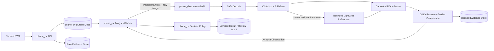

# Phone DINO Service 與 phone_cv 整合開發規畫

> 狀態：Increment 1 contract skeleton + Worker Reliability / E2E 已完成並通過獨立驗收  
> 日期：2026-08-01  
> 適用範圍：Phase 0 feasibility、Shadow、Controlled Pilot 前置工作  
> 非宣稱：本文件不代表實體 CV、DINO、LightGlue 或 Controlled Pilot 已通過驗收

## 1. 結論摘要

`phone_dino` 不應變成第二個業務後端。建議將它做成內部、可重放、近乎無狀態的 Python 影像分析服務，由 `phone_cv` 現有 durable job worker 呼叫。

責任邊界如下：

- `phone_cv` 是 Session、Upload、Queue、ExecutionBundle、DecisionPolicy、LayeredResult、Review、Human Disposition 與 Audit 的唯一權威。
- `phone_dino` 負責安全解碼、Server Still Gate、ChArUco 相機／平面正規化、獨立 target-relative 對位、DINO feature / Golden comparison 與分析證據。
- `phone_dino` 不得輸出或控制 `ManufacturingAction`、`HumanDispositionState` 或最終 `UserResult`。
- ChArUco Homography 不代表設備位置，只負責相機／平面正規化；設備與 Golden 的主對位必須來自 immutable target reference 與 stable target regions。LightGlue 只能是此介面的可選 residual refinement。
- LightGlue 未通過實體 blind safety benchmark 前，必須由 feature flag 關閉，或只在 shadow mode 產生觀察結果。
- Phase 0 先使用同步 internal HTTP API；耐久排程與重試只留在 `phone_cv`，不在 `phone_dino` 再建 Queue 或業務 DB。
- 第一版模型以 DINOv2 ViT-S/14 為 baseline；DINOv3 僅作 benchmark candidate，正式採用前須完成授權審查。

目前 `phone_cv` 可接受為本機 workflow simulator，但真實 CV 與 Controlled Pilot 仍是 NO-GO。最大缺口是實體 Recipe、幾何與品質驗證、Golden / blind validation 資料、真實 analyzer、身份與影像安全，而不只是模型服務程式碼。

### 1.1 2026-08-01 實作結果

本輪已完成可執行的跨服務垂直切片，但不擴張為實體 CV 或 Pilot 宣稱：

- `phone_dino` 已提供 strict FastAPI contract、Bearer service authentication、bounded multipart/image validation、raw hash 與兩種獨立 digest 驗證，以及明確 opt-in、hash-addressed 的 engineering fixture analyzer。
- `phone_dino` production/default 路徑現已具備 ChArUco plane normalization、Still Gate、target-relative ORB/Affine baseline、DINO comparison 與 offline artifact compiler；缺少 schema 1.1 target gates、模型或 artifact 時 readiness 仍 fail closed。LightGlue 尚未進正式路徑。
- `phone_cv` 已加入 authenticated `DinoAnalyzerClient`、嚴格 response/identity/version/numeric validation，且最終 DecisionPolicy、LayeredResult、ManufacturingAction 仍由 `phone_cv` 單一擁有。
- Recipe 現在分開 pin `bundleDigest` 與 `artifactPackageDigest`，並以 `analysisAuthorization=NON_PRODUCTION | PRODUCTION_VALIDATED` 明確限制正式分析；seed/legacy Recipe 預設為 `NON_PRODUCTION`。
- Durable worker 已使用固定 overall deadline、bounded attempts/lease recovery 與單一 transactional finalize；cancel、expiry、late response、bundle/upload/request identity mutation、missing data、existing-result recovery 均會收斂為可查詢終態，不再永久回傳 202。
- transport/contract/model 未產生可信 observation 時，結果為 `NOT_EVALUATED + NOT_RUN + SYSTEM_ERROR`，不得把未驗證的 Still Gate 證據標成 `ACCEPTED`。
- 一鍵 E2E runner 會自動建立暫存 fixture、選空 port、啟動真實 uvicorn、透過 authenticated multipart HTTP 執行 PASS／RECAPTURE／503 retry exhaustion，最後關閉 process 並刪除暫存資料。

獨立驗收證據：

- `phone_dino`: Python/OpenCV 4.13 與隔離 `.venv` OpenCV 4.14 均為 41/41 pytest 通過（含 production OpenCV adversarial alignment、synthetic full-scene 與 fresh-process determinism tests）；`pip check` 通過。
- `phone_cv`: TypeScript typecheck 通過；61/61 unit/integration tests 通過，另 5 項環境限定測試正常 gated skip；production build 與 artifact assertion 通過。
- `phone_cv -> phone_dino`: engineering authenticated multipart E2E 1/1、`simulation:false` production contract E2E 1/1 通過，完成後無 uvicorn process 殘留。
- 終審結論：本次 Contract Skeleton、Worker Reliability、Target-relative Alignment 與跨服務 E2E 為 `ACCEPT`（0 blocker、0 major）；Physical CV / Controlled Pilot 仍為 `REJECT/NO-GO`，直到第 15、16、19 節的實體證據完成。

### 1.2 Deterministic synthetic full-scene 增量

- `phone-dino-generate-synthetic-suite` 以固定 seed 產生 actual ChArUco、獨立 board/target/camera transforms、品質退化與安全 failure injection；repository 不提交生成圖片。
- `suite.manifest.json` 固定標示 `SYNTHETIC_ENGINEERING_ONLY`，並 pin generator/runtime、encoded hashes、ground-truth matrices、projected geometry、defect/occlusion support、decoded measurements 與預期安全終態。
- Metamorphic pairs 明確證明 board-only motion 不會改 target transform，target-only motion 不會改 board transform；combined motion 才同時改兩者。
- 真實 `OpenCvCharucoPlaneNormalizer → OpenCvTargetAligner` regression 覆蓋 accepted capture、缺件保存、target absent/duplicate/partial、held-out parallax、blur/exposure/glare、board occlusion 與 transform bounds。
- Fresh-process synthetic E2E 連續 5/5 通過；每輪重建 16 個場景並啟動新的 `simulation:false` service，共 80 次跨服務場景驗證，結束後 0 service process、0 temporary suite 殘留。
- CI 必須明確安裝 `.[dev,synthetic]`；若只跑一般 pytest 而 OpenCV 不存在，synthetic tests 會 skip，該結果不得列為 synthetic vision evidence。
- 這些資料只能作 engineering regression / E2E，不得用作 physical qualification、blind evidence、threshold tuning 或 Recipe production approval。

## 2. 分析方法與角色

本規畫依 `docs/multi_agent_roles` 中的五個角色 skill 進行：

1. `discover-user-needs`：把「加 DINO / LightGlue」還原為需要解決的現場問題。
2. `define-product-requirements`：定義 MUST / SHOULD / COULD、非目標與可測 acceptance criteria。
3. `design-solution-architecture`：設計跨服務邊界、契約、資料、失敗處理與 rollout。
4. `implement-engineering-work`：拆成可交付、可測試的工程增量。
5. `review-product-delivery`：獨立檢查現況缺口、假 PASS、資安與 operability 風險。

另採用 plan-first 工程流程；規畫完成後已依 Increment 1、Worker Reliability 與 E2E 範圍實作，結果記錄於 1.1 節。後續實體 CV 增量仍須逐步通過本文件的 evidence gates。

## 3. 現況基線

### 3.1 phone_cv 已具備

- React / PWA 拍攝流程與 client capability qualification。
- Capture Session 與分層狀態模型。
- 短效 Upload Ticket、hash、size、MIME 與基本 dimensions quarantine。
- SQLite durable job、submit idempotency、result polling。
- Simulation worker、Review Queue、append-only Human Disposition、Audit。
- `ExecutionBundle` 已包含 Recipe、Golden、Capture Policy、Decision Policy、Normalization、Analyzer Model、Client 與 Board Installation 版本欄位。
- Integration tests 已保護：simulation fail-closed、wrong binding、selected ordinal、submit idempotency、Still Gate 先於 analyzer、SYSTEM_ERROR 不轉 PASS、人工作業不覆寫 analyzer result。

### 3.2 尚未具備

- 真實 Server ChArUco、Still Gate、Normalization、Canonical ROI。
- 真實 DINO / Golden comparison、uncertainty、difference evidence。
- Golden artifact package、locked blind validation、threshold governance。
- 正式 Raw / Canonical / Golden / Difference evidence storage 與授權讀取。
- 真正由 Published Recipe materialize 的 ExecutionBundle；Capture Session 目前仍使用 seed bundle。
- Worker lease、heartbeat、late-result CAS、完整 dead-letter 終態。
- SSO / RBAC、可信 actor、service identity、private object storage、隔離 decoder。
- 真實手機、光線、Recipe 與 physical qualification 資料。

### 3.3 必須保留的安全語義

```text
Server Still Gate 不合格
  => CaptureState = RECAPTURE_REQUIRED
  => InspectionState = NOT_RUN
  => 不得產生 score / closestGolden / PASS

Analyzer、artifact 或 service 故障
  => SystemState = SYSTEM_ERROR
  => InspectionState = NOT_RUN
  => 不得降級成 Client PASS

Capture accepted + Analyzer evidence
  => phone_cv 的 pinned DecisionPolicy 產生 PASS / FAIL / REVIEW
  => phone_cv 再投影 UserResult 與 advisory ManufacturingAction
```

## 4. 使用者需求與產品定義

### 4.1 核心問題

真正要解決的是：將手機造成的角度、距離、FOV、光線、模糊與壓縮變異，和設備 PM 後的真實差異可靠分開。任何無法證明影像有效或模型可判定的情況，都必須安全地進入重拍、人工覆核或系統不可用，而不是猜測 PASS / FAIL。

### 4.2 角色與工作

| 角色 | 主要工作 |
|---|---|
| Operator | 用合格手機完成拍攝，得到單一且可操作的下一步。 |
| Recipe Owner | 建立、驗證、發布與回滾 Recipe / Golden，不讓錯誤 Golden 上線。 |
| Reviewer / Quality | 查看 Raw、Canonical、Golden、Difference、品質與版本證據，追加人工判斷。 |
| Vision Owner | 定義 failure modes、ground truth、資料 split、threshold 與 blind evaluation。 |
| Equipment Engineer | 定義 `d_crit`、平面性、BoardInstallation、ROI 與 stable / held-out landmarks。 |
| Platform / Security / SRE | 部署、身份、儲存、監控、kill switch、rollback 與事故處理。 |

### 4.3 MUST

1. 分離 Capture / Geometry validity 與 Inspection；前者失敗不得執行 DINO。
2. 每次分析綁定 Session、ordinal、raw SHA-256 與完整 immutable ExecutionBundle。
3. 正規化必須驗證 Board、Board-to-machine、held-out landmark 與 ROI local residual。
4. Analyzer 輸出可重現的 raw observations、版本與 evidence；最終業務映射留在 `phone_cv`。
5. Retry / redelivery 最多只產生一筆 authoritative result；late response 不得寫入已取消、過期或錯版 Session。
6. Golden、Alignment Mask、Inspection Mask、Exclusion Mask、Embedding 與 Threshold 全部 content-addressed 且可追溯。
7. 正式 Reviewer 能受權限控制地讀取 Raw / Canonical / Golden / Difference evidence。
8. Bundle mismatch、decoder failure、timeout、OOM、NaN 或 model unavailable 一律 fail closed。
9. Published Recipe 缺少已驗證的 Golden / Normalization / Model artifact 時不得 active。
10. 實體 blind dataset 必須按 PM event、User、Device、Day 分組，避免 train / tuning / validation leakage。

### 4.4 SHOULD

- Shadow 比較 ChArUco-only、ECC / SIFT 與 ALIKED + LightGlue。
- per-Recipe OOD / uncertainty 與 score drift monitoring。
- Golden feature 預計算、warm readiness、bounded artifact cache。
- Decoder 與 inference fault isolation、private object storage 與 retention policy。
- Reviewer UI 清楚標示 Difference Map 不是 defect segmentation 或因果證明。

### 4.5 COULD / 未來能力

- 固定補光、第二 fiducial、固定拍攝治具。
- Hybrid native camera adapter。
- Managed device、NFC / BLE 或 dynamic challenge 抵抗惡意 replay。
- Scratch / Measurement / 3D 各自獨立的新 pipeline。

### 4.6 v1 非目標

- 不自動控制機台 Release / Hold。
- 不宣稱修正明顯 3D parallax。
- 不以 LightGlue 或 DINO heatmap 證明 defect 的因果位置。
- 不保證所有手機、瀏覽器、鏡頭與光線皆可通過。
- 不以同一 burst 的照片同時構成主要 Golden 與 blind validation 證據。

## 5. 建議系統架構



### 5.1 phone_cv ownership

- User identity、RBAC、site / recipe scope。
- Capture Session、nonce、expiry、Machine / Board binding。
- Upload ticket、quarantine admission、raw artifact lifecycle。
- Job claim、lease、retry、deadline、dead-letter、cancellation。
- Active Recipe pointer 與 immutable ExecutionBundle pinning。
- DecisionPolicy、LayeredResult、ManufacturingAction、UserResult。
- Review Queue、Human Disposition、Audit、evidence authorization。

### 5.2 phone_dino ownership

- Request schema 與 bundle / hash verification。
- Safe decode、orientation、dimension / pixel / timeout guard。
- ChArUco / QR 重驗與 Server Still Gate。
- Canonical transform、ROI / mask application。
- 可選的 bounded residual refinement。
- DINO preprocessing、embedding、multi-Golden comparison。
- Difference evidence、uncertainty proxy、stage metrics。
- Artifact integrity、model readiness、health / metrics。

### 5.3 不採用的設計

| 選項 | 決定 | 原因 |
|---|---|---|
| phone_dino 再建 Queue / result DB | 拒絕 | 形成雙重真相與複雜的跨服務一致性問題。 |
| phone_dino 直接讀 phone_cv SQLite | 拒絕 | 強耦合資料結構、權限與部署。 |
| 手機直接呼叫 phone_dino | 拒絕 | 繞過 Session、Bundle、RBAC、quarantine 與 audit。 |
| 任意 URL / filesystem path 作 input | 拒絕 | SSRF、path traversal 與資料外洩風險。 |
| 每張影像強制跑 LightGlue | 拒絕 | 不必要的延遲，且可能把 PM 異常對回正常。 |
| 立即導入 Triton / Kubernetes | 延後 | 先以實測流量、GPU 利用率與 fault isolation 證明需求。 |

## 6. 端到端分析流程

### 6.1 Online Capture

1. `phone_cv` 建立 Session，從 active immutable Recipe 原子化 materialize 並 pin ExecutionBundle。
2. Client 完成 capability check、preview gate 與 camera-produced Still。
3. `phone_cv` 驗證 upload ticket、hash、size、MIME、基本 dimensions 並保存 Raw evidence。
4. Submit 以 Idempotency-Key 原子產生 job。
5. Worker 以 lease claim job，確認 Session 仍為 `SUBMITTED` 後轉為 `PROCESSING`。
6. Worker 呼叫 `phone_dino`，傳送 pinned manifest 與 raw image。
7. `phone_dino` 重驗 request、hash、bundle、artifact digests。
8. Safe decoder 完成 Orientation 與完整 decode；不可信 metadata 不進 log。
9. ChArUco 建立相機／平面 Homography `H_plane`，只執行 board binding、coverage、quality 與 plane geometry gates；不得推論設備位置。
10. 以 immutable target reference 的 stable alignment regions 定位設備，估算 bounded target transform `T_target`；inspection regions 不得參與 fit。
11. 使用與 alignment / inspection regions 都不重疊的 held-out regions 驗證 `T_target`，並拒絕 second coherent hypothesis、parallax、集中匹配或超界 transform。
12. Gate 合格後才產生 target-aligned canonical ROI 並執行 DINO；DINO 不得接收 board-canonical 全圖。
13. `phone_dino` 回傳 observations、metrics、versions、artifact descriptors 與 timings。
14. `phone_cv` 在同一 transaction 內 CAS 驗證 job lease、Session state、raw hash、bundle 與尚無 result。
15. `phone_cv` 套用 pinned DecisionPolicy，寫 LayeredResult、evidence metadata、job completion 與 Audit。

### 6.2 Golden / Recipe Publish

1. Recipe Owner 上傳跨 Session / User / Device / Condition 的 Good candidates。
2. Normalizer 產生 canonical candidates 與完整 quality evidence。
3. Vision / Equipment Owner 定義 Inspection、Alignment、Held-out、Exclusion masks。
4. 系統分析 stable edges；Owner 確認不可因 PM 改變的 alignment regions。
5. 產生 Golden embeddings、distance distributions 與 artifact manifest。
6. Threshold 只使用 tuning set；locked blind set 在 freeze 前不可用於選參數。
7. `validate` 固定 validation snapshot、draft revision 與全部 artifact digests。
8. Publish 驗 semantic attestation、CAS 與 package completeness 後才更新 active pointer。
9. 新 Session 使用新 Bundle；既有 Session 保持原 pinned Bundle。

## 7. ChArUco、Target Alignment 與 LightGlue 策略

### 7.1 主原則

- `H_plane` 來自 ChArUco，只代表相機／board plane；board 與設備的相對位置不得視為固定。
- 設備主對位 `T_target` 必須來自 immutable target reference、stable alignment regions 與獨立 held-out regions。
- 最終 canonical transform 為 `T_target × H_plane`；DINO 只接收此 target-aligned ROI。
- LightGlue 若啟用，只能在相同 masks 與 gates 下替換或 refine `T_target`，不得使用 inspection content。
- 無法以單一平面模型說明的 parallax、彎曲、Board 移位或多深度 ROI 必須重拍、停用 Recipe 或改治具。

### 7.2 LightGlue 觸發條件

```text
ChArUco basic gate fail
  => RECAPTURE_REQUIRED / BOARD_INVALID

ChArUco 合格，但 target 不存在、重複、parallax 或 transform 超界
  => RECAPTURE_REQUIRED / NOT_RUN

ChArUco + bounded target affine + held-out gate 合格
  => 產生 target canonical ROI
  => DINO comparison

LightGlue shadow candidate
  => 使用相同 alignment / held-out / inspection masks
  => 不影響正式結果，直到 blind safety benchmark 通過
```

### 7.3 Matching 安全規則

- 兩張影像的 keypoints 都必須位於 immutable `alignmentMask`。
- `alignmentMask` 必須排除 `inspectionMask`、Board、反光區、遮擋區及可能因 PM 改變的零件。
- 不得用 DINO distance 最小化來挑 transform。
- 不得使用整張影像自由匹配。
- 初始只允許 Similarity transform；Affine 需 Recipe opt-in 與 blind evidence。
- 第二個任意 Homography 預設禁止。
- 必須限制 matches、inliers、inlier ratio、spatial coverage、translation、rotation、scale、shear、condition number 與 improvement margin。
- Post-check 必須使用未參與 fit 的 landmarks / edge segments，且每段獨立通過，不得以平均值掩蓋局部錯位。
- 保存 `H0`、`T_residual`、before / after residual、inlier 分布與 reject reason。

### 7.4 候選技術

- Baseline A：ChArUco plane + target-relative ORB/Affine（目前 fail-closed 實作）。
- Baseline B：ChArUco plane + target-relative ECC / SIFT。
- Candidate C：ChArUco plane + ALIKED + LightGlue target alignment。
- DINOv2 patch feature matching 可作研究比較，但不與 anomaly score 共用 transform optimization。

選用 ALIKED / DISK / SIFT 而不是直接採用官方 SuperPoint 權重，原因是 SuperPoint 權重授權較嚴格。正式交付需產生第三方軟體與權重清單。

## 8. DINO 分析策略

### 8.1 Baseline

- Python 3.12。
- PyTorch inference mode；CPU / CUDA adapter。
- DINOv2 ViT-S/14 作第一個可重現 baseline。
- 多張 Approved Golden，不以單一 Golden 作全部依據。
- 預計算 Golden global / patch embeddings，cache key 包含 Golden、Model、Preprocess、Normalization 與 Mask digests。

### 8.2 建議 observations

- Global distance / similarity，必須明確命名方向與範圍。
- 每張 Golden distance 與 nearest Golden ID。
- Golden distance distribution / disagreement。
- Patch-level difference map。
- High-difference regions，僅作提示。
- OOD / uncertainty proxy，未校準前不得命名為 probability / confidence。
- per-ROI observations 與 timings。

### 8.3 Decision Policy

`phone_dino` 回傳 observations；`phone_cv` 的 `decisionPolicyVersion` 唯一負責 threshold 與 `InspectionState`。

```text
distance <= pass threshold 且 uncertainty 合格
  => PASS

distance >= fail threshold 且 failure policy 合格
  => FAIL

介於門檻、多 Golden 分歧或 OOD
  => REVIEW
```

門檻必須是 per-Recipe、per-Model、per-Normalization 的相容 artifact，且在 blind evaluation 前凍結。

## 9. 跨服務 API 契約草案

### 9.1 Transport

Phase 0 使用：

```http
POST /internal/v1/analyze
Content-Type: multipart/form-data

manifest: application/json
image: image/jpeg | image/png
```

原因：目前 `phone_cv` 把 raw bytes 存在 SQLite；直接 multipart 最少改動，不需要任意 URL 或共享 DB。導入 private object storage 後，可新增受限制的 `ImageSource` adapter；只允許核准 bucket / prefix / HTTPS / no redirect / short TTL，仍須重驗 size 與 hash。

### 9.2 AnalyzeRequest

```json
{
  "schemaVersion": "1.0",
  "requestId": "job-id",
  "sessionId": "session-id",
  "captureOrdinal": 1,
  "correlationId": "correlation-id",
  "deadline": "2026-08-01T10:00:15Z",
  "rawSha256": "...",
  "contentType": "image/jpeg",
  "recipeId": "PM-ABC-001",
  "machineId": "MC-07",
  "boardId": "CB-001",
  "inspectionIntent": "PM_SIMILARITY",
  "executionBundleDigest": "sha256:...",
  "executionBundle": {
    "recipeVersion": "sha256:...",
    "goldenSetVersion": "sha256:...",
    "capturePolicyVersion": "sha256:...",
    "decisionPolicyVersion": "sha256:...",
    "normalizationPipelineVersion": "sha256:...",
    "analyzerModelVersion": "sha256:...",
    "clientAssetVersion": "sha256:...",
    "boardInstallationVersion": "sha256:..."
  },
  "artifactPackageDigest": "sha256:..."
}
```

Client 不得提供 mask path、模型 path、任意 URL、threshold 或 PASS / FAIL。

### 9.3 AnalyzeObservation

```json
{
  "schemaVersion": "1.0",
  "requestId": "job-id",
  "analysisId": "content-addressed-id",
  "rawSha256": "...",
  "resolvedVersions": {
    "executionBundleDigest": "sha256:...",
    "artifactPackageDigest": "sha256:...",
    "analyzerModelVersion": "sha256:...",
    "analyzerRuntimeVersion": "sha256:container...",
    "normalizationRuntimeVersion": "sha256:code..."
  },
  "captureAssessment": {
    "state": "ACCEPTED",
    "reasonCodes": [],
    "boardBinding": true,
    "boardCoverage": 0.24,
    "heldOutBoardResidualMm": 0.18,
    "stableLandmarkResidualsMm": [0.16, 0.19, 0.17],
    "roiLocalResidualMm": 0.21,
    "sharpness": 0.84,
    "overExposureRatio": 0.003,
    "glareRatio": 0.01
  },
  "normalization": {
    "canonicalSha256": "...",
    "charucoTransform": [[1, 0, 0], [0, 1, 0], [0, 0, 1]],
    "refinement": {
      "attempted": true,
      "method": "ALIKED_LIGHTGLUE",
      "transformType": "SIMILARITY",
      "accepted": true,
      "matches": 142,
      "inliers": 119,
      "inlierRatio": 0.838,
      "residualBeforeMm": 0.43,
      "residualAfterMm": 0.21
    }
  },
  "analysis": {
    "state": "RUN",
    "metric": "cosine_distance",
    "globalDistance": 0.18,
    "nearestGoldenId": "GOLDEN-005",
    "nearestGoldenDistance": 0.14,
    "uncertaintyMetric": "golden_disagreement_v1",
    "uncertainty": 0.09,
    "highDifferenceRegions": []
  },
  "artifacts": [
    {
      "kind": "CANONICAL",
      "objectKey": "derived/...",
      "sha256": "...",
      "contentType": "image/png",
      "bytes": 123456,
      "accessClass": "REVIEWER"
    }
  ],
  "timingsMs": {
    "decode": 20,
    "normalization": 90,
    "refinement": 45,
    "inference": 310
  }
}
```

Response 必須拒絕 NaN / Infinity、unknown enum、digest mismatch、過大 arrays 與超出 schema version 的 payload。

### 9.4 錯誤與重試

| 情況 | API 表達 | phone_cv 行為 | 重試 |
|---|---|---|---|
| Blur / glare / pose / residual 不合格 | 200 domain response，`RECAPTURE_REQUIRED`、`analysis=NOT_RUN` | 寫安全的 LayeredResult | 否 |
| Image bytes / schema 永久無效 | 400 / 422 | `INVALID` 或 `SYSTEM_ERROR`，Audit | 否 |
| Bundle / artifact digest mismatch | 409 | `SYSTEM_ERROR`、dead-letter、告警 | 否 |
| Capacity / not ready / temporary dependency | 429 / 503 / 504 | 有界 exponential backoff | 是 |
| Transport timeout / connection reset | transport error | 同 request identity 重試 | 是 |
| Retry exhausted / OOM / internal error | terminal error | `SYSTEM_ERROR / SYSTEM_UNAVAILABLE` | 依 SOP 人工 requeue |

只有 429、503、504 與 transport transient error 可以自動重試。重試不得換 raw image、Bundle、model 或 threshold。

## 10. Golden Artifact Package

每個 Published Bundle 需指向不可變、content-addressed package：

- Recipe、BoardInstallation、physical scale、canonical size。
- ChArUco dictionary / layout / canonical corners。
- Golden raw / canonical refs 與 hash。
- Alignment reference、Alignment Mask、Held-out Mask。
- Inspection ROI、Exclusion Mask、Stable Edge segments。
- Normalization config 與允許的 photometric operations。
- LightGlue extractor / matcher / transform bounds / feature flag。
- DINO model、preprocess、input size、embedding dtype / shape。
- Precomputed Golden embeddings。
- Quality calibration distributions。
- Validation snapshot、semantic attestation、creator / time。
- 每個檔案的 SHA-256、package signature 與 dependency / weight SBOM。

`decisionPolicyVersion` 保持獨立，讓 threshold policy 可以更新而不重新封裝 model weights；但 policy manifest 必須列出相容的 Golden、Model、Normalization 與 Metric versions。

需要新增一個真正的 `executionBundleDigest`，由 canonical JSON 計算。現有 `RecipeSummary.bundleDigest` 與 component digests 不應混用；seed 中的示意字串也不能作正式 content address。

## 11. Job、冪等與一致性

### 11.1 Job schema 增量

建議新增：

- `lease_owner`
- `locked_at`
- `lease_expires_at`
- `heartbeat_at`
- `analyzer_request_id`
- `terminal_reason_code`
- `response_digest`

啟動時只能重新排程 lease 已逾期的 `PROCESSING` jobs，不能無條件重置全部。

### 11.2 Idempotency identity

```text
(sessionId, captureOrdinal, rawSha256, executionBundleDigest)
```

`requestId` 使用 job ID；`analysisId` 建議由上述 identity 與 analyzer runtime digest 決定性產生。

### 11.3 Result commit CAS

Worker 收到回應後，必須在同一 transaction 驗證：

- result 尚不存在。
- job 仍為 `PROCESSING` 且 lease owner 相同。
- Session 仍為 `PROCESSING`。
- response 的 request / raw hash / Bundle digests 全部相同。
- job 未取消、未過期、未被 kill switch 終止。

全部成立才可 insert result、complete job 與寫 completion audit。任何 late response 必須丟棄並寫 `LATE_ANALYSIS_DISCARDED`，不得先 insert result 再檢查 Session。

Dead job 必須產生可查詢的 terminal `SYSTEM_ERROR` result，或 result endpoint 明確回 terminal error；不能讓 UI 永遠輪詢 202。

## 12. 安全、隱私與供應鏈

- `phone_dino` 只部署於 private network；手機不可直連。
- `phone_cv` 與 `phone_dino` 使用 workload identity、mTLS 或短效 service token，驗 audience / issuer。
- Machine / Board / Recipe / User / nonce 必須是 Server 強制 binding，不得因 request 欄位省略而跳過。
- Decoder 在低權限 process / container 中，限制 file bytes、pixels、width / height、CPU、RAM、decode time、ICC / EXIF 與 decompression bomb。
- Raw、Canonical、Golden、Difference、Embedding 視為敏感製程資料；private-by-default、傳輸與靜態加密。
- Evidence 授權依 site / recipe / role，下載與刪除都留 audit。
- Log 不包含圖像 bytes、token、完整 presigned URL 或敏感 EXIF。
- 模型、權重、container、Python dependencies 固定 digest，建立 SBOM 與第三方 license inventory。
- Retention、legal hold、備份、刪除與 reanalysis policy 必須在 Pilot 前核准。

## 13. Observability 與運行

### 13.1 IDs

所有 log / trace / metric 以以下三個 ID 串聯：

- `correlationId`：一次使用者流程。
- `requestId`：一次 durable job identity。
- `analysisId`：特定 raw + Bundle + runtime 的分析 identity。

### 13.2 Metrics

- Queue depth / age、lease timeout、retry、dead jobs。
- API / stage p50 / p95 / p99 latency。
- Decoder reject reasons。
- Still Gate reject reasons。
- LightGlue trigger / accept / reject、residual before / after。
- Inference concurrency、OOM、429、cache hit、artifact hash fail。
- PASS / FAIL / REVIEW / RECAPTURE / SYSTEM_ERROR rates。
- per-Recipe score、uncertainty、review rate 與 device drift。

Recipe ID 等高基數或敏感欄位不直接作公共 metrics label；需要明細時使用受控 logs / analytics。

### 13.3 Health

- Liveness：process/event loop 活著。
- Readiness：模型已 warm、必要 artifact 可載入、digest 正確、decoder 與 evidence store 可用、有可接受容量。
- Graceful drain：停止接新分析，完成或安全釋放已 claim 的 jobs。
- 一個 GPU worker process 原則上只載一份 model；以 semaphore 控制 concurrency。

## 14. 實際開發計畫

### Increment 0：決策與實體 Fixture Gate

**產出**

- 第一個 planar / near-planar Recipe。
- `d_crit`、critical failure modes、Good / Bad ground truth owner。
- Board / ROI / stable / held-out regions 與光線 envelope。
- 代表性 device matrix、延遲與誤判成本。
- 跨服務 ADR、OpenAPI / JSON Schema 與 reason-code catalog。

**完成條件**

- 所有 P0 問題有 owner 與書面決定。
- 沒有 `d_crit` 或無法保證 planar / near-planar 時，停止影像模型開發並改評估治具 / 3D 方法。

### Increment 1：Contract-first Skeleton

**phone_dino**

- 建立 Python 3.12、`uv`、FastAPI、Pydantic、pytest、Docker skeleton。
- `/healthz`、`/readyz`、`/internal/v1/analyze`。
- Strict schema、hash / bundle verification、fake analyzer、structured logs。

**phone_cv**

- 抽出 `AnalyzerClient` interface：`FixtureAnalyzerClient`、`DinoAnalyzerClient`。
- 新增 shared observation / artifact schema 與 consumer-driven contract tests。
- 保留 simulator truth boundary。

**完成條件**

- 同一 contract fixture 在 TypeScript 與 Python 都通過。
- malformed、unknown schema、digest mismatch、timeout 測試 fail closed。

### Increment 2：Worker Reliability 前置修正

**phone_cv**

- Job lease / heartbeat / expiry。
- Claim 與 final result commit CAS。
- Cancel、expire、dead-letter 與 terminal SYSTEM_ERROR result。
- Retry classification、deadline、circuit breaker。
- Published active bundle 真正連到 Capture Session。

**完成條件**

- duplicate delivery、worker crash、restart、late response、cancel、expiry、rollback race 全部最多一筆 authoritative result。
- UI 不會在 terminal failure 永遠輪詢 202。

### Increment 3：Safe Decode、Still Gate、Normalization

**phone_dino**

- Isolated decoder 與 resource limits。
- EXIF orientation、ChArUco / QR binding。
- `H0`、canonical image、inspection / exclusion masks。
- held-out / stable / ROI local residual 與 blur / exposure / glare / occlusion metrics。
- Canonical artifact 與完整 provenance。

**完成條件**

- 所有 bad capture 在 DINO 前停止。
- Board movement、wrong binding、malformed image、decompression bomb、timeout 有 failure-injection 測試。

### Increment 4：Residual Alignment Feasibility

- 建立 ChArUco-only、ECC / SIFT、ALIKED + LightGlue 三組 pipeline。
- 使用相同 locked evaluation protocol 比較。
- 加入 adversarial defects：缺件、位移、旋轉、局部遮擋，確認 refinement 不會消除 anomaly。
- 實作 per-Recipe feature flag 與 hard transform bounds。

**完成條件**

- LightGlue 必須在跨 Device residual / repeatability 上有實質改善。
- Board movement / bad capture / anomaly-preservation 測試為 0 unsafe accept。
- 未達標則維持 feature flag off，不阻擋 ChArUco-only pipeline。

### Increment 5：DINO Baseline 與 Offline Evaluator

- DINOv2 ViT-S/14 adapter、model / preprocess digest。
- Golden feature builder 與 immutable cache。
- Global / patch observations、multi-Golden distance、difference map。
- Dataset manifest、grouped split、threshold tuning、blind evaluator。
- Determinism / tolerance 與 CPU / GPU latency benchmark。

**完成條件**

- 相同 input + Bundle 重跑 state 一致；float tolerance 有證據。
- blind dataset 未被 Golden / alignment / threshold tuning 使用。
- 每個 failure mode 分別報告 recall / false PASS，不只報總 accuracy。

### Increment 6：Decision、Evidence 與 Review 整合

**phone_cv**

- Pinned DecisionPolicy 將 observations 映射成 `InspectionState`。
- 擴充 Result evidence snapshot、quality / alignment metrics 與 artifact hashes。
- 正式 Reviewer evidence routes、RBAC、short-lived access。
- UI 顯示 Raw / Canonical / Golden / Difference 與安全說明。

**完成條件**

- Still Gate fail 無 analyzer score。
- Analyzer error 永不 PASS。
- Human Disposition 仍為 append-only，不修改原 analyzer result。

### Increment 7：Deployment、Shadow、Canary

- Linux pinned container、service identity、private network。
- Object store adapter、retention、encryption、backup / restore。
- Metrics、alerts、runbooks、kill switch、rollback drill。
- Shadow mode：結果不影響 UserResult / ManufacturingAction。
- Allowlisted Recipe canary；逐 Recipe 啟用 active Bundle。

**完成條件**

- 服務中斷、artifact corruption、OOM、NaN、object store outage 全部 fail closed。
- 15 分鐘內回到已知良好 Bundle；in-flight Session 不靜默換版。

### Increment 8：Controlled Pilot Gate

- 完成 Device matrix、Operator usability、geometry、quality、model 與 reliability acceptance。
- 建立 Reviewer SLA、fallback SOP、support playbook、drift dashboard。
- 只在所有 Blocker 關閉後發布 advisory Pilot。

## 15. 測試與驗收矩陣

| Gate | 最低證據 / Acceptance |
|---|---|
| Contract | TS / Python shared fixtures；unknown schema、NaN、digest mismatch 被拒。 |
| Idempotency | 同 job 至少重送 3 次，只有一筆 authoritative result 與 completion audit。 |
| Late result | Cancel / expire / rollback 後的回應被丟棄且 audit。 |
| Still Gate | 不合格為 `RECAPTURE_REQUIRED + NOT_RUN`，無 score / closest Golden。 |
| Analyzer outage | `SYSTEM_ERROR`，永不 PASS。 |
| Geometry | Board held-out P95 與每段 stable residual 都不超過 Recipe `E_max`。 |
| LightGlue safety | movable / defect ROI 不參與 fit；每類 board movement / severe bad capture 至少 60，0 unsafe accept。 |
| Reproducibility | 同 Bundle 重跑 final state 相同；float 差異不超過核准 tolerance。 |
| Critical PM | 每 failure mode 至少 60 個獨立 Bad，threshold 預先凍結，0 false PASS。 |
| Good false FAIL | 至少 300 個獨立 Good；point estimate ≤2%，95% upper bound ≤5%。 |
| REVIEW | valid Pilot captures ≤10%，100% 有 owner / SLA 可追蹤。 |
| Evidence | Raw / Canonical / Golden / Difference hash 與 manifest 一致，未授權拒絕。 |
| Audit | 隨機至少 100 筆，Raw、Recipe、Board、Golden、Pipeline、Model、Threshold、User、Disposition 100% 可追。 |
| Latency | Capture-to-result P95 ≤15 秒，並分解 decode / normalization / refinement / inference / queue。 |
| Reliability | Pilot API availability ≥99.5%；queue backlog 可恢復，無 silent drop。 |
| Security | malformed、oversize、bomb、timeout、SSRF、path traversal、cross-site evidence access 測試通過。 |

## 16. phone_cv 必修缺口與優先級

### Blocker

1. 無真實 pipeline、physical Recipe 與 blind evidence。
2. Golden / validation / threshold governance 尚不存在。
3. 身份、RBAC、binding、nonce、isolated decode、private evidence storage 未完成。
4. LightGlue 若未限制 Alignment Mask / transform / held-out check，可能把真 defect warp 回正常。

### Major

1. Worker 在確認 Session CAS 前可能先 insert result，late worker 可留下錯誤 authoritative result。
2. DEAD job 沒有 terminal result，result polling 可能永遠回 202。
3. Published Recipe / active pointer 尚未真正供 Capture Session materialize Bundle。
4. Session expiry、cancel、queued expiry、late response 狀態不完整。
5. 正式 evidence / review / audit 沒有可信 actor 與 resource authorization。
6. `/health` 未檢查 model / artifacts readiness，缺 timeout、circuit breaker、metrics 與 drift。
7. `LayeredResult.score` 語義過度模糊；需要 metric name、direction、range 與 calibration version。

### Minor

1. `WorkflowState` 宣告 `QUALIFIED`，實作卻直接 `CREATED → CAPTURE_READY`。
2. Simulation `canonicalSha256` 不對應真正 artifact；production contract 必須禁止此情況。
3. Audit list 缺穩定 pagination 與完整稽核匯出策略。

## 17. Ownership 與依賴順序

| Owner | 工作 |
|---|---|
| phone_cv | AnalyzerClient、worker lease / CAS、DecisionPolicy、shared schema、result / evidence / audit、object lifecycle。 |
| phone_dino | Pydantic contract、decoder、normalizer / gate、refinement、DINO、artifact writer、health / metrics、offline evaluator。 |
| Vision / Quality | Recipe、masks、landmarks、Golden、failure modes、ground truth、blind labels、threshold signoff。 |
| Platform / Security | Service identity、private storage、network policy、retention、GPU runtime、alerts、runbooks。 |

依賴順序：

```text
Product decisions + contract fixtures
  ├─ phone_cv AnalyzerClient + lease/CAS
  └─ phone_dino service skeleton
        ↓
Golden package + Normalization
        ↓
LightGlue feasibility
        ↓
DINO + Offline evaluator
        ↓
Cross-service failure injection
        ↓
Shadow → Canary → Controlled Pilot
```

## 18. 開工預設：自問自答

以下是多角色交叉審查後採用的暫定答案。它們的目的，是在未知條件下讓工程以可逆、fail-closed 的方式開始；`Assumption` 不是實體證據，也不能用來宣稱 Pilot ready。

### Q1：第一個 Recipe、平面性、`d_crit`、Failure Modes 與 ground truth 如何決定？

**Answer / Decision**

- 先沿用 `PM-ABC-001` 作 `NON_PRODUCTION` contract fixture，不把 seed 名稱或資料當成實體 Recipe 證據。
- 另建立尺寸已知、可生成的 planar ChArUco engineering fixture，測試 Normalization、Mask、Residual 與 failure injection。
- Engineering fixture 暫用 `dCritMm=2.0`，只為走通 (E_{max})、canonical resolution 與 schema；不得外推到任何機台。
- Production manifest 將 `planarityQualification`、`dCritMm`、`failureModeTaxonomyVersion` 與 `groundTruthApproval` 設為必填。缺一時 Bundle 不得 active，回 `BUNDLE_NOT_READY / SYSTEM_ERROR`，不能用 `REVIEW` 掩蓋配置缺失。
- 工程 failure set 至少包含 wrong binding、Board 平移／旋轉／翹起、blur、glare、occlusion、零件缺失、零件位移與 parallax。
- Equipment Engineer 提供物理量測，Quality Owner 核准 Good / Bad，Vision Owner 管資料與評估但不能單獨創造 ground truth。

**Evidence needed**

- 第一個實體 ROI 的深度／平面性、最小關鍵差異、標準 Good / Bad 件及 Failure Mode 雙角色簽核。

**Revisit trigger**

- 一旦選出候選機台，立即以實體數據取代 `2.0 mm` fixture 值；若 Good parallax 與 Bad 差異重疊，該 Recipe No-Go，改治具、多視角或 3D 方法。

### Q2：假設目前沒有足夠實圖，工程怎麼開始？

**Answer / Decision**

- 採雙軌：先完成 TypeScript ↔ Python contract、fake analyzer E2E；同時完成 generated fixture 的 decoder / normalization tests 與 DINO smoke test。
- Synthetic 或公開圖片不得用來選 production threshold，也不得證明 LightGlue / DINO feasibility。
- 缺 validated Golden、locked threshold 或 artifact digest 的非 simulation Session 一律 `BUNDLE_NOT_READY / SYSTEM_ERROR`。
- 實圖到位後依序進行 Golden curation → grouped split → threshold freeze → locked blind evaluation → shadow integration。

**Assumption**

- 現在視為沒有足以支持統計結論的正式資料；這個假設只會讓計畫更保守。

**Evidence needed**

- Golden 至少跨 3 Session、2 User、2 device conditions；Pilot 另需每 Failure Mode 至少 60 個獨立 Bad、Good 至少 300，且 PM event / User / Device / Day 不跨 split。

**Revisit trigger**

- 第一批已簽核實圖到位，或實體 EXIF、解析度、ROI 特性迫使 contract 改版。

### Q3：phone_dino 部署在哪裡、先用 CPU 還是 GPU？

**Answer / Decision**

- 程式邊界採獨立 internal service；Phase 0 與 `phone_cv` 放同一主機、分開低權限 container / process，以 loopback 或 private Docker network 通訊。
- 第一版 CPU-only、DINOv2 ViT-S/14 常駐、inference concurrency=1；保留 `cpu/cuda` device adapter。
- 端到端 P95 目標維持 15 秒，單次 internal analyze deadline 先設 10 秒；超時為 `SYSTEM_ERROR`，不切換較弱 gate 或模型。
- 不先導入 Triton、Kubernetes 或 batching。

**Assumption**

- Early shadow 負載低，單 job 串行足夠；目前也未偵測到本機 NVIDIA runtime。

**Evidence needed**

- 目標主機 CPU / GPU / RAM、影像尺寸、cold / warm timings、jobs/min、queue wait 與端到端 P50 / P95 / P99。

**Revisit trigger**

- Warm analyzer P95 >10 秒、端到端 P95 >15 秒、queue wait P95 >5 秒、OOM 或需要 concurrency >1 時，先搬到單卡內網 GPU worker；只有量化證明 batching / 多模型需求後才評估 Triton。

### Q4：誰擁有 PASS／FAIL／REVIEW 與 ManufacturingAction？

**Answer / Decision**

- `phone_cv` 的 pinned `DecisionPolicy` 是唯一權威，負責 `InspectionState`、`UserResult` 與 `ManufacturingAction`。
- `phone_dino` 只回 gate outcome、geometry / quality metrics、distance、uncertainty、nearest Golden、artifact descriptors、reason codes 與版本。
- Dino schema 禁止 `RECOMMEND_RELEASE / HOLD`；若回傳 non-authoritative suggestion，也不得直接落為結果，並須用 contract vector 核對。

**Why**

- 這保留既有五層狀態、版本與 audit 邊界，避免兩個服務各自解讀 threshold，形成雙重真相或 unsafe PASS。

**Revisit trigger**

- 若結果將驅動設備，或政策無法以穩定 observations 表達，必須另開安全、品質與架構變更，不得在現有 API 中偷偷轉移權威。

### Q5：LightGlue 要不要使用、可以修正多少？

**Answer / Decision**

- 預設 feature flag **OFF**，先只在 shadow benchmark 執行，不改 canonical image 或正式結果。
- ChArUco Homography 只做 plane normalization；設備主路徑是獨立 target-relative alignment。沒有核准的 immutable alignment、held-out 與 inspection masks 時一律 `RECAPTURE_REQUIRED / NOT_RUN`。
- `alignmentMask` 只能含不因 PM 改變的 stable landmarks，並排除 Inspection ROI、Board、反光區、遮擋區與可動零件。
- 初期只允許 Similarity transform；Affine 需 Recipe opt-in；第二 Homography 預設禁止。
- Correction bounds 不設跨 Recipe 通用正式值，必須由 `d_crit`、(E_{max}) 與 blind data 推導並由 Vision + Equipment + Quality 簽核。

**Evidence needed**

- ChArUco-only、ECC / SIFT、ALIKED + LightGlue 的跨 Device residual、latency、anomaly preservation 與每類至少 60 個安全注入；要求 0 unsafe accept。

**Revisit trigger**

- Target-relative ORB/Affine 已過 gate，就可不導入 LightGlue；只有 bounded replacement/refinement 顯著改善、且 held-out checks 與 0 unsafe accept 成立，才進 canary。

### Q6：REVIEW 誰處理、多久、逾時怎麼辦？

**Answer / Decision**

- 當班 Quality Reviewer 是 owner，Operations 是 escalation owner；Pilot 前必須有具名 roster，否則 Pilot No-Go。
- 暫定 30 分鐘未受理就 escalation，4 小時內完成 disposition。這只作容量與流程設計，不是假裝已核准的現場 SLA。
- REVIEW 期間維持 `ManufacturingAction=MANUAL_REVIEW` 與既有未放行／安全狀態，永遠不因逾時轉 PASS。
- 4 小時未完成時寫 `REVIEW_SLA_BREACHED`、通知 Quality + Operations，走人工 PM / Quality fallback SOP。

**Evidence needed**

- 班表、通知渠道、設備 hold 語義、人工 fallback SOP，以及 Pilot 的 review arrival / service-time 分布。

**Revisit trigger**

- 現場允許等待時間更短、REVIEW queue 過載或責任角色不同；可調 SLA，但不得更改「逾時不 PASS」。

### Q7：Evidence 與 Embedding 保存多久、誰可以看？

**Answer / Decision**

- 開發期只用非敏感 fixtures；正式圖片不得提交到 repo，也不再存大型 SQLite BLOB。
- Pilot 容量估算預設：Raw / Canonical / Difference 保存 30 天；per-capture embedding 不持久化；Golden / masks / Golden embeddings 隨 Bundle 保存，退役後再留 1 年；Result / Audit metadata 保存至少 1 年。
- 使用 private object storage、加密與 deny-by-default。Reviewer 只讀授權 site / recipe；Operator 不能瀏覽他人影像；匯出預設禁止；刪除經受稽核 lifecycle 執行。
- Embedding 同樣視為敏感製程資料，不能因不是圖片就放寬權限。

**Assumption**

- 30 天足夠支援 Pilot review 與事故分析；期限只是估算，不是法規或公司政策。

**Revisit trigger**

- Security / Legal / Quality policy、legal hold、備份、刪除或 reanalysis 需求確定後，以正式政策覆蓋此預設。

### Q8：SSO、RBAC 與 service identity 怎麼做？

**Answer / Decision**

- 開發環境可使用明確標示的 local fake identity，僅限 localhost / tests，production build 預設關閉。
- Pilot 採 provider-neutral OIDC / OAuth2 adapter；IdP 尚未指定不阻擋 skeleton。
- RBAC deny-by-default：Operator 只能 capture 授權 site / recipe；Recipe Owner 管自己的 Recipe；Reviewer 讀授權 evidence 並追加 disposition；Auditor 預設只讀 metadata / audit，Raw 需額外授權。
- 不信任 `x-demo-user` 作正式 actor。
- `phone_cv → phone_dino` 使用獨立 workload identity；同機 Phase 0 可用 private network + rotated random token，Pilot 前升級 mTLS 或短效 service JWT。

**Evidence needed**

- IdP metadata、claims、site / recipe group mapping、joiner / mover / leaver、break-glass、credential rotation 與 audit 要求。

**Revisit trigger**

- IdP 不支援 OIDC、需要 ABAC / multi-tenant，或服務跨 trust zone；跨 trust zone 時 mTLS / network policy 變成強制。

### Q9：模型權重與 Python dependencies 可以在 runtime 下載嗎？

**Answer / Decision**

- Runtime 一律禁止連外下載。
- 受控 build / release 階段從 allowlist source 取得，驗 SHA-256、來源、license、SBOM 與 malware scan，鏡像到 internal registry 或封裝在唯讀 artifact volume。
- 啟動時 digest 驗證失敗即 readiness false；不得自動使用浮動 cache 或 fallback model。
- DINOv2 ViT-S/14 是 baseline；DINOv3 等 custom / research license 未經 Legal 書面核准，只能留在隔離 research benchmark。

**Revisit trigger**

- Legal 拒絕、baseline 精度不達標、air-gapped 部署或公司 registry / AI policy 確定時重新選模型與供應鏈流程。

### Q10：Device matrix、光線與 Board recertification 怎麼定？

**Answer / Decision**

- 開發煙霧測試先用 1 台目標 Android / Chrome、1 台目標 iPhone / Safari 與 1 台較低階／舊裝置。
- Phase 0 acceptance 仍使用規格最低矩陣：至少 5 組 iPhone / iOS / Safari 與 8 組 Android / Chrome，每組 30 次 auto capture；每 Session 仍做 dynamic qualification。
- 第一個實體 feasibility 優先採固定、漫射、可重現補光，先縮小 photometric envelope；uncontrolled ambient 另列條件。
- Equipment / Maintenance owner 管 BoardInstallation；每班或每次 PM 前目視與 binding check。偵測到碰撞、移動、重貼、污染、翹曲、threshold breach 或 drift 時立即停用並 recertify。

**Evidence needed**

- 現場裝置 inventory、lux / CCT / 方向 / glare 量測、補光可安裝性、Board 材料與實際 drift rate。

**Revisit trigger**

- Server recapture >10%、Still / FOV mismatch、主要裝置不在矩陣或固定補光不可行；若主要 Web 平台仍不穩定，再啟動 Hybrid Camera adapter。

### Q11：要不要整合 MES／PM 工單？

**Answer / Decision**

- v1 不呼叫 MES mutation API、不觸發 Release / Hold，也不自動改設備狀態。
- 可預留 external work-order / reference ID 與 append-only audit link，但只讀／關聯，不執行動作。
- PASS 仍只是 `RECOMMEND_RELEASE`；實際放行由既有人工 PM / Quality 流程負責。

**Why**

- 這讓 Phase 0 驗證影像與流程，不把尚未驗證的模型變成設備控制系統。

**Revisit trigger**

- 任何自動寫 MES、正式放行或移除人工責任的需求，都視為獨立 functional-safety / quality 專案，需要 maker-checker 與更高統計證據。

### Q12：v1 如何處理蓄意 replay？

**Answer / Decision**

- v1 明確接受「不抵抗蓄意螢幕／印刷照片重播」，只允許在受控現場、受訓且已驗證身份、advisory Pilot 使用。
- 仍防一般誤操作：禁止 Gallery、camera-in-app capture、短效 Session / ticket、nonce、User / Machine / Board / Recipe / time binding、hash 與 audit。
- UI、risk register 與 Pilot report 必須明示此限制，不得宣稱 anti-spoof 或 proof-of-presence。

**Evidence needed**

- Security threat model、惡意內部人／外部攻擊可能性、設備後果與風險接受簽核。

**Revisit trigger**

- 自動 Release / Hold、無人監督、承攬／外部人員使用、replay incident 或合規要求出現時，managed native device、attestation、proximity 或 dynamic physical challenge 變成上線前置，且需重新驗證。

### 18.1 統一治理規則

- Assumption 可以讓 Increment 0 / 1 開工，但不能被報告成 Evidence。
- 缺少實體 Recipe / validated Bundle 時必須 fail closed，不能用 `REVIEW` 隱藏部署或配置錯誤。
- Revisit trigger 發生時建立 ADR / Change Proposal，重跑受影響的 contract、offline、failure-injection 與 Pilot gates。
- 現在可開始 contract skeleton、fake analyzer，以及 `phone_cv` worker lease / CAS / dead-terminal 修正；這些工作不得輸出真實 PASS。
- 只有實體 Recipe、`d_crit`、ground truth、資料 split、受控儲存就緒後，才可進 offline CV feasibility。
- 真實 online verdict、Controlled Pilot 與 automatic Release / Hold 仍分別受第 19 節 release boundary 限制。

## 19. Release Recommendation

- `phone_cv` 本機 simulator：**Conditional Accept**，限開發、展示與 workflow validation。
- `phone_cv + phone_dino` 真實結果：**Reject for Pilot**，直到本文件 Blocker 與 validation gates 關閉。
- LightGlue：**Shadow / benchmark only**，直到 anomaly-preservation 與 0 unsafe-accept 證據成立。
- Controlled Pilot：只能是 advisory；automatic Release / Hold 仍為 NO-GO。

## 20. 參考

- `C:\code\claude\phone_cv\README.md`
- `C:\code\claude\phone_cv\docs\spec\mobile_pm_charuco_image_verification_spec.md`
- `C:\code\claude\phone_cv\src\shared\contracts.ts`
- `C:\code\claude\phone_cv\src\server\app.ts`
- `C:\code\claude\phone_cv\src\server\worker.ts`
- `C:\code\claude\phone_cv\tests\integration\server.test.ts`
- DINOv2 official repository: <https://github.com/facebookresearch/dinov2>
- DINOv3 official repository: <https://github.com/facebookresearch/dinov3>
- LightGlue official repository: <https://github.com/cvg/LightGlue>
- PyTorch installation guidance: <https://docs.pytorch.org/get-started/locally/>
- OpenCV image decode limits: <https://docs.opencv.org/4.12.0/d6/dea/tutorial_env_reference.html>
